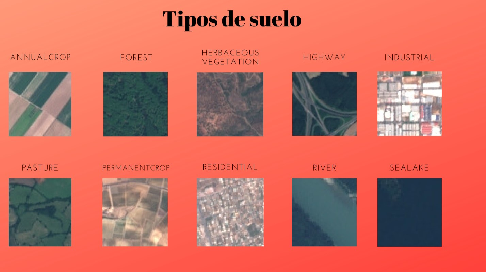

# TERRENOS URBANIZABLES

## El propósito del proyecto es conseguir saber, a través de una foto sacada de google maps, que tipo de suelo es, y si se podría urbanizar o no

## Acciones tomadas para llegar al propósito:

###  1. Hemos descargado el data set EURO_SAT de la web: MULTIMEDIA ANALYSIS & DATA MININ.
###     Data set que consta de 27.000 fotos sacadas via satelite y dividido en 10 clases de suelo.

   

###  2. - Creamos un modelo de prediccioón usando una red neuronal convolucional(cnn).
###       Caracteristicas del modelo:

